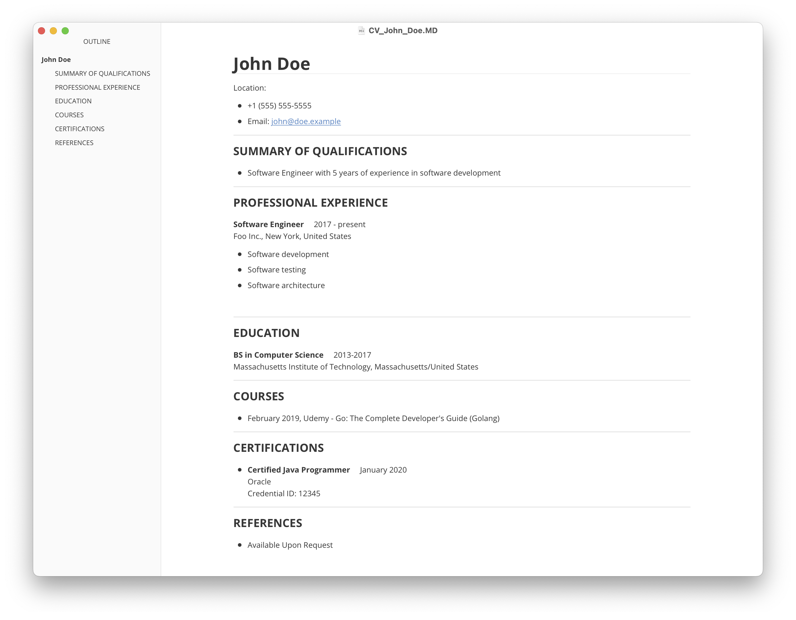

# cv-terraformed
A terraform module to render your CV in markdown format.

## Usage

Step 1:  Use the terraform module and provide your CV details.

```hcl
module "cv-terraformed" {
  source = "github.com/yuriipolishchuk/cv-terraformed//modules/cv-terraformed"
  
  fullname = "John Doe"
  email = "john@doe.example"
  phone = "+1 (555) 555-5555"

  qualifications = [
    "Software Engineer with 5 years of experience in software development",
  ]

  experience = [
    {
      position = "Software Engineer",
      company  = "Foo Inc.",
      country  = "United States",
      city     = "New York",
      years    = "2017 - present",
      duties = [
        "Software development",
        "Software testing",
        "Software architecture",
      ]
    },
  ]

  volunteer_experience = []

  courses = [
    {
      name     = "Go: The Complete Developer's Guide (Golang)"
      provider = "Udemy"
      year     = "February 2019"
    },
  ]

  certifications = [
    {
      name          = "Certified Java Programmer"
      provider      = "Oracle"
      year          = "January 2020"
      credential_id = "12345"
    },
  ]

  education = [
    {
      university = "Massachusetts Institute of Technology"
      city       = "Massachusetts"
      country    = "United States"
      years      = "2013-2017"
      degree     = "BS in Computer Science"
      gpa        = "4.2",
    },
  ]
  
  open_rendered_cv = true
}

```
Step 2:  Run the `terraform apply` command.

Step 3:  Rendered CV in a Markdown format is opened in your default pdf viewer.



See other [examples](./examples/).


## Requirements

No requirements.

## Providers

| Name | Version |
|------|---------|
| local | n/a |
| null | n/a |

## Inputs

| Name | Description | Type | Default | Required |
|------|-------------|------|---------|:--------:|
| certifications | n/a | <pre>list(<br>    object(<br>      {<br>        name          = string,<br>        year          = string,<br>        provider      = string,<br>        credential_id = string,<br>      }<br>    )<br>  )</pre> | `[]` | no |
| courses | n/a | <pre>list(<br>    object(<br>      {<br>        name     = string,<br>        year     = string,<br>        provider = string,<br>      }<br>    )<br>  )</pre> | `[]` | no |
| education | n/a | <pre>list(<br>    object(<br>      {<br>        degree     = string,<br>        university = string,<br>        city       = string,<br>        country    = string,<br>        years      = string,<br>      }<br>    )<br>  )</pre> | `[]` | no |
| email | n/a | `string` | `""` | no |
| experience | n/a | <pre>list(<br>    object(<br>      {<br>        position = string,<br>        company  = string,<br>        city     = string,<br>        country  = string,<br>        years    = string,<br>        duties   = list(string)<br>      }<br>    )<br>  )</pre> | `[]` | no |
| fullname | n/a | `string` | n/a | yes |
| github | n/a | `string` | `""` | no |
| linkedin | n/a | `string` | `""` | no |
| location | n/a | `string` | `""` | no |
| open\_rendered\_cv | n/a | `bool` | `false` | no |
| phone | n/a | `string` | `""` | no |
| qualifications | n/a | `list(string)` | `[]` | no |
| references | n/a | `list(string)` | <pre>[<br>  "Available Upon Request"<br>]</pre> | no |
| template\_name | n/a | `string` | `"default.md.tftpl"` | no |
| volunteer\_experience | n/a | <pre>list(<br>    object(<br>      {<br>        position = string,<br>        company  = string,<br>        city     = string,<br>        country  = string,<br>        years    = string,<br>        duties   = list(string)<br>      }<br>    )<br>  )</pre> | `[]` | no |
| website | n/a | `string` | `""` | no |

## Outputs

No output.

